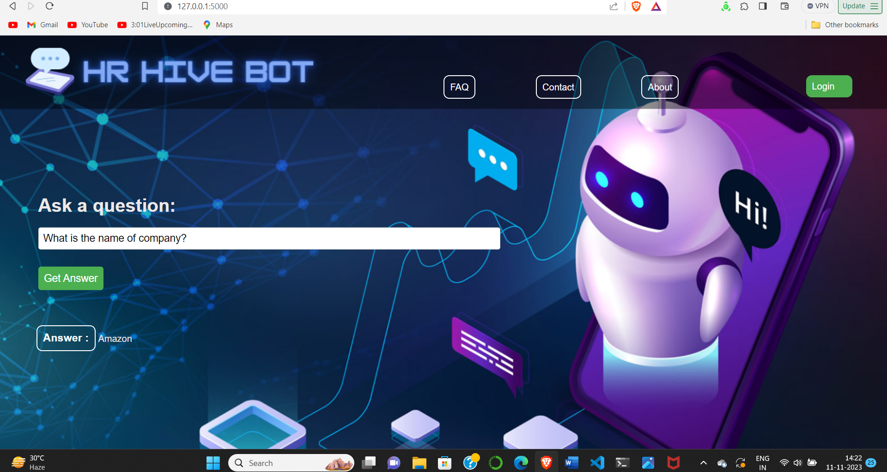

# HR Chatbot Project

Welcome to the HR Chatbot project! This chatbot is designed to handle HR-related queries using the deepset/bert-base-cased-squad2 model. It can be deployed either as a Flask web application or as a Streamlit app.

## Installation

### Flask Deployment

1. Clone the repository:

   ```bash
   git clone https://github.com/riddhiman-ghatak/HR_Bot_ByteSimplified.git
   
   cd HR_Bot_ByteSimplified
   ```
2. Install Dependencies:
   ```bash
   pip install -r requirements.txt
   ```
3. Run the flask app: 
   ```bash
   python app.py
   ```
visit http://127.0.0.1:5000 in your web browser.

### Streamlit Deployment

1. clone the repository:
    
    ```bash
   git clone https://github.com/riddhiman-ghatak/HR_Bot_ByteSimplified.git
   
   cd HR_Bot_ByteSimplified

2. install Streamlit

   ```bash
   pip install Streamlit
   ```
3.  Install Dependencies:
   ```bash
   pip install -r requirements.txt
   ```   
4. Run the Streamlit app:
   ```bash
   streamlit run streamlit_app.py
   ```   
Visit the provided URL in your terminal.

## Model overview

The HR Chatbot leverages the power of BERT (Bidirectional Encoder Representations from Transformers), specifically the `deepset/bert-base-cased-squad2` model. BERT is a state-of-the-art natural language processing (NLP) model developed by Google that excels in understanding context and nuance in textual data.The BERT model has been fine-tuned on a custom dataset containing HR-related queries and responses. The fine-tuning process is detailed in the `base_line_BERT_uncased.ipynb` notebook. Fine-tuning helps the model specialize in understanding and responding to queries specific to human resources, improving its performance on this particular domain.


## Dependencies

- [Python 3.10.5](https://www.python.org/downloads/)
- [Flask 3.0.0](https://flask.palletsprojects.com/en/2.0.x/)
- [Streamlit 1.28.1](https://streamlit.io/)
- [Transformers 4.35.0](https://huggingface.co/transformers/)

You can install the required Python packages using the provided `requirements.txt` file

## Pages Overview

- `home`: Landing page
- `login`: Login page with the username **user** and password **password**.
- `contact`: Contact information
- `about`: Information about the HR Chatbot project
- `faq`: Frequently Asked Questions.

## Screenshots

### Flask app




### Streamlit app


Feel free to explore and enhance the chatbot project! If you encounter any issues or have suggestions, please open an issue in the repository.
